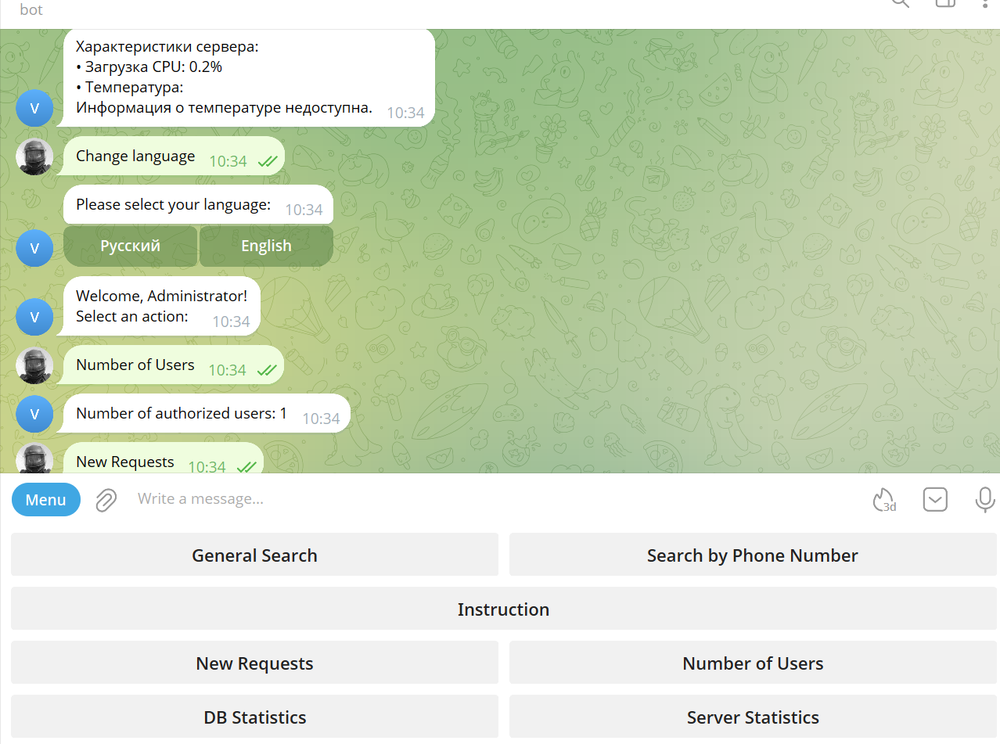

# MyBot - Телеграм бот для поиска информации в базах данных MySQL (MariaDB)

## Ru, En - Localization

### RU
[Инструкция по использованию - RU](docs/ru_usage.md)<br>
[Запуск и настройка - RU](docs/ru_configuration.md)<br>
[Работа с БД MySQL - RU](docs/ru_db.md)<br>
[Полезное и работа c контейнерами Docker - RU](docs/ru_docker.md)<br>
[Полезные инструменты - RU](docs/ru_helps.md)<br>

### RU
[Instruction - EN](docs/en_usage.md)<br>
[Deploy - EN](docs/en_configuration.md)<br>
[Work with MySQL - EN](docs/en_db.md)<br>
[Helps for Docker - EN](docs/en_docker.md)<br>
[Some instruments - EN](docs/en_helps.md)<br>

The following screenshots illustrate key parts of the application:

|     Main screen  (administrator)     |
|:------------------------------------:|
|  |


▎Telegram Bot for Fast Database Search in Docker Containers

## English

### Overview

This project is a Telegram bot designed for efficient search and retrieval of information from large databases (MariaDB) using phone numbers or general keyword queries. The system is containerized with Docker Compose and leverages Sphinx Search for high-speed full-text indexing, reducing search time from minutes to seconds even with databases containing hundreds of millions of rows. The repository also includes utilities for database management and project maintenance.

### Features

• Fast Search: Uses Sphinx Search for rapid full-text queries, making searches up to 100x faster compared to standard SQL queries.

• Flexible Queries: Search by phone number or by keywords.

• User Management: Authorization and admin roles for secure access.

• Utility Scripts: Tools for batch importing SQL dumps, splitting large dumps, generating project tree structures, and more.

• Dockerized: Easily deployable using Docker Compose with separate containers for the bot, MariaDB, and Sphinx Search.

• Extensible Handlers: Modular code structure for easy customization and extension.

### Project Structure
```
project-root/
├── .gitignore
├── Dockerfile
├── README.MD
├── bot/
│   ├── _handlers.py
│   ├── auth.py
│   ├── config.py
│   ├── data.py
│   ├── db.py
│   ├── handlers/
│   │   ├── admin_handlers.py
│   │   ├── bot_core.py
│   │   ├── common_handlers.py
│   │   ├── language_handlers.py
│   │   └── user_handlers.py
│   ├── id_fields_db.py
│   ├── language_texts.py
│   ├── main.py
│   ├── search.py
│   ├── table_utils.py
│   ├── user_stats.json
│   └── utils.py
├── docker/
│   ├── bot/
│   │   └── Dockerfile
│   ├── mysql/
│   │   ├── Dockerfile
│   │   └── conf.d/
│   │       └── 99-custom.cnf
│   └── sphinx/
│       ├── Dockerfile
│       ├── example_sphinx.conf
│       └── sphinx-entrypoint.sh
├── docker-compose.yml
├── requirements.txt
└── some_things/
    ├── README.MD
    ├── generate_tree.py
    ├── import_all_sql.bat
    ├── import_all_sql.sh
    └── split_sql.sh
```

### How It Works

1. MariaDB Container: Hosts the main database with all the data.

2. Sphinx Search Container: Indexes the MariaDB tables for instant full-text search.

3. Telegram Bot Container: Receives user queries via Telegram, searches the database using Sphinx, and returns results.

4. Utility Scripts: Help with importing, splitting, and managing large SQL dumps.

### Getting Started

1. Clone this repository.

2. Configure environment variables and settings in bot/config.py and docker/.

3. Build and start all containers:
    ```
    docker-compose up --build
    ```

4. Use the utility scripts in some_things/ as needed.

• Adjust settings in config.py according to your environment.

   • Update allowed_users.json with the list of authorized Telegram user IDs.

**Attention** Please select a search method in user_handlers.py (lines 163-167): if your base is not big use dbasync_perform_phone_search - it is simple, just erase "#" and comment this line(167) **results = await sphinx_search_phone_full(pool, query_text)**
My DB is about 100_000_000 lines and it takes **15 minutes** to find something
For fast search use sphinx_search_phone_full (search takes 10 seconds)
for use Sphinx your need to rename example_sphinx.conf to sphinx.conf and  edit it.

After editing you need to index all tables (**before this please edit sphinx.conf**)
```
docker exec sphinx indexer --all --rotate --config /etc/sphinxsearch/sphinx.conf
```

### Requirements

• Docker  Docker Compose

• Telegram Bot API token (set in config)

• Python 3.8+


## Русский

### Описание

Данный проект — это Телеграм-бот для быстрого поиска информации в больших базах данных (MariaDB) по номеру телефона или ключевым словам. Вся система развернута в контейнерах через Docker Compose и использует Sphinx Search для ускоренного полнотекстового поиска, что позволяет сократить время поиска с 15 минут до нескольких секунд даже на базе с сотнями миллионов строк. В репозитории также есть утилиты для управления базой и обслуживания проекта.

### Возможности

• Быстрый поиск: Благодаря Sphinx Search поиск по базе происходит до 100 раз быстрее стандартных SQL-запросов.

• Гибкие запросы: Поиск по номеру телефона или по ключевым словам.

• Управление пользователями: Авторизация и разделение ролей (админ/пользователь).

• Вспомогательные скрипты: Для пакетного импорта дампов SQL, разделения больших дампов, создания дерева проекта и других задач.

• Контейнеризация: Легкий запуск через Docker Compose — отдельные контейнеры для бота, MariaDB и Sphinx Search.

• Модульная архитектура: Удобная структура кода для расширения и кастомизации.

### Структура проекта

```
project-root/
├── .gitignore
├── Dockerfile
├── README.MD
├── bot/
│   ├── _handlers.py
│   ├── auth.py
│   ├── config.py
│   ├── data.py
│   ├── db.py
│   ├── handlers/
│   │   ├── admin_handlers.py
│   │   ├── bot_core.py
│   │   ├── common_handlers.py
│   │   ├── language_handlers.py
│   │   └── user_handlers.py
│   ├── id_fields_db.py
│   ├── language_texts.py
│   ├── main.py
│   ├── search.py
│   ├── table_utils.py
│   ├── user_stats.json
│   └── utils.py
├── docker/
│   ├── bot/
│   │   └── Dockerfile
│   ├── mysql/
│   │   ├── Dockerfile
│   │   └── conf.d/
│   │       └── 99-custom.cnf
│   └── sphinx/
│       ├── Dockerfile
│       ├── example_sphinx.conf
│       └── sphinx-entrypoint.sh
├── docker-compose.yml
├── requirements.txt
└── some_things/
    ├── README.MD
    ├── generate_tree.py
    ├── import_all_sql.bat
    ├── import_all_sql.sh
    └── split_sql.sh
```


### Как это работает

1. Контейнер MariaDB: Хранит основную базу данных.

2. Контейнер Sphinx Search: Индексирует таблицы MariaDB для мгновенного полнотекстового поиска.

3. Контейнер Телеграм-бота: Получает запросы от пользователей через Telegram, ищет данные с помощью Sphinx и отправляет результаты.

4. Вспомогательные скрипты: Помогают с импортом, разделением и управлением большими дампами SQL.

### Быстрый старт

1. Клонируйте репозиторий.

2. Настройте переменные окружения и параметры в bot/config.py и папке docker/.

3. Соберите и запустите все контейнеры:
    ```
    docker-compose up --build
    ```

4. Используйте утилиты из папки some_things/ по мере необходимости.

• Adjust settings in config.py according to your environment.

   • Update allowed_users.json with the list of authorized Telegram user IDs.

**Attention** Please select a search method in user_handlers.py (lines 163-167): if your base is not big use dbasync_perform_phone_search - it is simple, just erase "#" and comment this line(167) **results = await sphinx_search_phone_full(pool, query_text)**
My DB is about 100_000_000 lines and it takes **15 minutes** to find something
For fast search use sphinx_search_phone_full (search takes 10 seconds)
for use Sphinx your need to rename example_sphinx.conf to sphinx.conf and  edit it.

After editing you need to index all tables (**before this please edit sphinx.conf**)
```
docker exec sphinx indexer --all --rotate --config /etc/sphinxsearch/sphinx.conf
```

### Требования

• Docker и Docker Compose  

• Токен Telegram Bot API (указать в конфиге)

• Python 3.8+


## TODO:
- ~~Мультимпорт с кириллице;~~ - Замена PowerShell на cmd
- ~~Закончить рефакторинг кода;~~
- ~~Добавить авторизацию;~~
- ~~Добавить администратора и возможность администратору добавлять пользователей;~~
- ~~Отправка уведомлений админу в случае перезапуска сервера;~~
- ~~Возможность админу следить за состоянием сервера (нагрузка, температура и т.д.)~~
- ~~Сделать файл results.html временным и сразу после отправки удалять~~